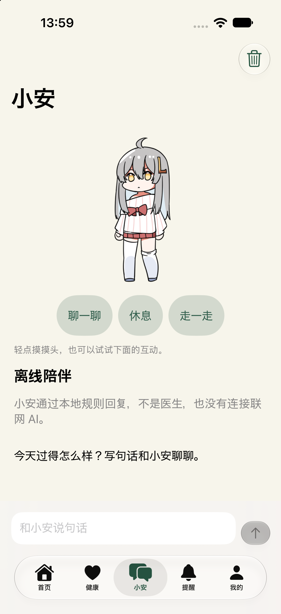
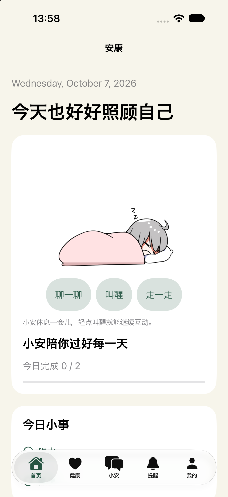
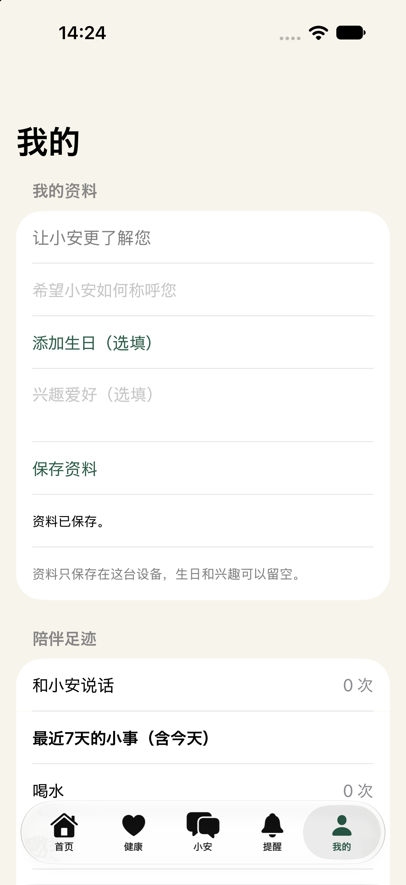
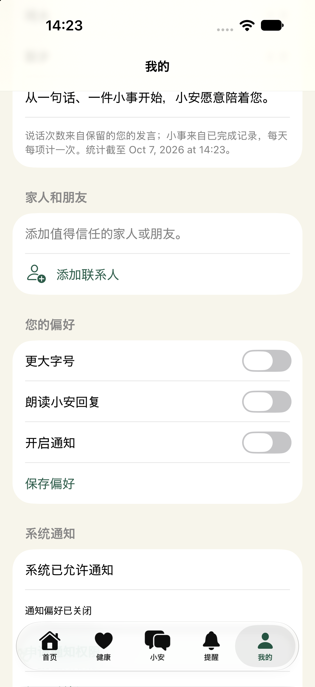

# EasyLife — 从日常小事开始的老年人陪伴设计

**产品设计 / 交互设计 / 原生 iOS 原型**  
记录日期：2026-10-07 · 当前阶段：可运行原型，尚未开展目标老年用户验证

EasyLife 的初衷，是做一个给老年人陪伴用的应用。它的中文界面围绕“小安”展开：老人可以和它说句话、摸摸头，也可以记录健康、查看用药提醒，或者完成今天的喝水与散步小事。

我希望探索的是：**一个数字伙伴，能否通过容易理解、可以反复发生的小互动，进入老人的日常生活？** 当前版本还不能回答它是否能缓解孤独，但已经让我把这个问题变成了一个可以操作、检查和继续修改的原型。

EasyLife 的原项目曾获得 **2025 年“东方之星”省三等奖**。本次迭代从原项目的 Web 草案开始，用 SwiftUI 重写为 iPhone 应用，并引入 iPet Swift 版的角色动画。设计与实现之间的变化，逐渐集中到三个方面：陪伴如何被感知、日常功能如何围绕陪伴组织，以及个人记录如何形成连续性。

## 01 / 先明确：陪伴应该发生在什么地方？

在 [iPet 项目](https://xufilps.github.io/projects/ipet/)中，我关注数字角色如何进入桌面空间。EasyLife 延续了对数字陪伴的兴趣，但把使用对象和场景转向老年人的手机日常。

这次我更关心的，是老人打开应用后能否迅速找到熟悉的对象，知道可以做什么，并从自己的操作中得到清楚、温和的反馈。给角色增加更多动作只是其中一部分；称呼、按钮、记录、提醒和返回后的状态，都影响着这种体验。

在当前阶段，这些仍是我的设计目标与假设。我没有把“老人一定喜欢桌宠”或“动画能够改善孤独感”当成已经得到证实的结论。后续需要让真实使用者体验，再检查这些想法是否成立。

## 02 / 从 Web 草案走向可以持续使用的原型

原 Web 草案给出了应用的页面与交互基础。进入原生 iOS 实现后，需要把页面中的按钮和表单接到真正的数据、系统通知与设备能力上，让一次操作能够产生结果，并在重新打开应用后保留下来。

因此，Swift 重写的重点包括原生页面、本地保存、按日任务、药品提醒、联系人与聊天记录。首页、健康、小安、提醒、我的五个入口沿用原来的内容方向，让原型具备一条完整的使用路径。

暖白底色、深绿色操作和橙色强调也被保留下来。这个方向提供了较温和的视觉基调，同时还需要继续通过字号、对比度、点击区域和真实任务测试检验可用性；配色本身不能证明它已经适合老年人。

## 03 / 让小安成为首页中可以回应的对象

我把首页中原有的宠物替换为 iPet Swift 版的萝莉斯动画，界面仍称它为“小安”。角色在首页与陪伴页中出现，能够接受轻点和长按，并在完成今日小事时给出庆祝反馈。

复用角色时，我保留了原动画的透明画布、阶段和帧时长，再接入 EasyLife 自己的交互逻辑。这样可以把已有的动作表达带进新场景，同时把应用的重点留在老人的使用体验上。

EasyLife 当前没有导入 iPet 的商店、金币、等级成长或完整养成系统。小安的作用是回应互动、连接页面与生活记录。它采用的角色与动画来自 VPet / iPet，版权归原制作组；应用中保留了可见的来源入口和完整授权声明。

*实际模拟器画面：小安、互动按钮与离线聊天入口。截图中的数据为空，没有预填个人信息。*

## 04 / 把互动做得容易发现

最初的角色互动依靠轻点摸头和长按回应。它们让用户可以直接触碰角色，但单靠手势，用户未必能发现全部操作。因此，我在角色下方补上了三个有明确文字的按钮。

| 操作 | 小安的反馈 |
| --- | --- |
| 轻点角色 | 摸头动作与文字回应 |
| 长按角色 | 陪伴互动动作与文字回应 |
| 聊一聊 | 说话动作与一句邀请交流的文字 |
| 休息／叫醒 | 进入持续睡眠，或播放起身动作 |
| 走一走 | 在卡片中原地走几步 |
| 完成今日小事 | 播放一次庆祝，再返回待机 |

可见按钮为用户提供了明确入口，轻点与长按则保留了直接接触角色的感觉。“聊一聊”按钮目前只触发角色动作和反馈文字，真正的文字聊天仍通过输入框发送，两者的行为各自清楚。

按钮标签内设置了至少 44pt 的高度，横向放不下时可以改为纵向排列。角色的手势也需要与页面滚动同时工作：用户从小安所在的位置向上滑动，仍应能正常浏览下面的内容。

## 05 / 动作之间，也需要连续的逻辑

增加动作后，新的问题出现在动作切换之间。睡着时再次互动应该怎样回应，叫醒后按钮应该显示什么，庆祝结束后又回到哪里，这些都需要明确的规则。

当前版本让休息动画经过开始阶段后持续循环，叫醒时播放结束阶段；摸头、说话、走路或任务庆祝也会中断休息。按钮文字跟随实际播放状态变化，避免小安已经站起来，界面却还写着“叫醒”。

普通待机累计约二十秒后，小安会轮换打哈欠或张望，播放一轮后回到待机。只有角色可见、应用在前台时才累计这段时间；休息和其他互动期间不会插入自动小动作。

这里的设计意图，是在用户暂时没有操作时保留一些轻微变化，同时让主动操作拥有清晰的反馈。自动动作的频率和表现是否合适，仍需要目标使用者的体验反馈。

*实际模拟器画面：休息后显示睡眠姿态，中间按钮同步变成“叫醒”。*

## 06 / 把生活小事接到陪伴里

首页提供喝水与散步两项小事，以及用药提醒、健康记录和联系人入口。用户完成一件事后，小安会给出庆祝反馈，首页也同步更新当天进度。

我希望这种反馈能让日常记录多一点回应感。喝水、散步和用药确认仍各自有明确的数据含义：原地走路的角色动画不会替用户完成散步记录，点击宠物也不会自动改变健康或用药数据。

健康页支持血压、心率、步数和睡眠记录；提醒页支持药品信息、每日提醒、稍后提醒及当天服用确认。这些功能给原型提供了日常使用的内容，但当前没有临床效果验证，也不会根据记录生成诊断或用药剂量。

## 07 / “我的”页开始围绕使用者组织

在这一轮调整中，我重新明确了项目的初衷：它是给老年人陪伴用的应用。因此，“我的”页需要让个人资料与陪伴记录更容易被看见。

页面现在依次提供我的资料、陪伴足迹、家人和朋友、使用偏好。称呼、生日与兴趣都可以留空；未填写时，用“让小安更了解您”作为提示。称呼保存后会用于首页问候，生日能够添加和清除，兴趣则先作为本地资料保留。

这些信息的填写由用户自己决定。当前版本尚未让聊天根据生日或兴趣生成个性化内容，所以我也没有把保存资料描述成小安已经能够理解或记住用户的全部生活。

*实际模拟器画面：可选资料、保存入口与真实记录统计。本次检查使用的测试输入已经清空。*

“陪伴足迹”显示本机保留的用户发言次数，以及最近七天喝水、散步的小事记录。小安自己的回复不会计入发言次数，每天同一项小事只计一次，撤销后统计也会更新。

这些数字目前是查看已有记录的一种方式。我没有加入排名、连续打卡要求，也没有把聊天条数解释成陪伴质量。对这个项目而言，更值得观察的是用户是否愿意回来，能否轻松完成自己的操作，以及是否觉得这些回应有意义。

## 08 / 给家人朋友保留清楚的位置

个人资料后面是“家人和朋友”。它保留了原有联系人的添加、编辑和拨号功能，让值得信任的人能够出现在应用里；拨号前会显示确认。

这个入口也表达了我对数字陪伴的理解：应用可以提供日常回应，也应方便用户联系现实中的人。它目前只是本地联系人与电话入口，没有家属端、远程监护或自动联络功能。

大字、朗读和通知偏好放在后面的独立分组，个人资料与偏好分别保存。用户修改称呼时，已经保存的朗读或字号设置应当保留，操作结果也需要通过成功或失败文字说明。

*实际模拟器画面：家友入口与后置偏好。联系人为空时提供添加提示。*

## 09 / 可靠性也是陪伴体验的一部分

原型开发中，我遇到过角色初始无法正常绘制的问题。代码检查和构建成功没有直接暴露它，最终需要结合模拟器画面、暂停状态与渲染日志定位，再调整原生视图的呈现和恢复机制。

这个过程提醒我，角色“会播放动画”和用户“能持续看到正确反馈”之间还有一段距离。当前版本在角色完全离开滚动视口、离开页面或进入后台时暂停播放并清理纹理缓存，返回后恢复；减少动态效果开启时，使用稳定姿态与文字反馈，并关闭自动小动作。

数据同样需要保持连续。新增个人资料后，旧版存档仍应能够读取；保存失败时保留原数据与编辑草稿。生日以年月日存储，避免手机切换时区后变成另一天。这些细节通常不显眼，却直接影响用户是否能信任自己的操作结果。

## 10 / AI 协作中的设计与判断

这个项目通过与 AI 协作推进：我提出目标、选择方向和具体修改，AI 协助分析代码、实现功能、编写检查，并通过子代理进行定向复审。

过程中的几次调整都来自具体要求：把 Web 草案重写为 iOS 应用，把首页宠物替换为 iPet 角色，再增加动作交互，并围绕老年人陪伴重新组织“我的”页。每次修改后，都需要回到可运行的原型里检查结果。

我逐渐把这种协作理解为一条往返路径：提出使用意图，落实到页面与行为，再根据真实画面和检查结果继续调整。AI 加快了实现与排查，但哪些信息应该出现、操作应该怎样回应，以及当前证据能够支持什么，仍然需要持续判断。

## 11 / 当前结果与下一步

截至这次记录，EasyLife 已经形成一个可以在 iPhone 模拟器运行的原生原型：五个页面、角色互动、离线文字聊天与系统朗读、本地健康记录、药品提醒、联系人，以及个人资料和陪伴足迹已经接通。

模型、提醒、动画时间线、资源导入与旧 Web 检查通过，iOS 模拟器构建成功。现场检查确认了资料保存、重启读取、生日清除、首页称呼同步、角色按钮，以及完成和撤销小事后的足迹更新。

这些结果证明了当前原型的部分操作和数据路径能够工作。它尚未发布到 App Store，也没有完成真机性能、通知实际到达、完整 VoiceOver 听感或目标老年用户的使用验证。因此，我还不能据此宣称它改善了孤独感，或已经形成成熟的适老化产品。

下一阶段，我希望围绕几件真实任务观察老人如何使用：能否找到小安、理解互动按钮、填写或跳过资料、联系家人，以及看懂提醒和保存反馈。角色风格是否亲切、文字是否合适、页面是否需要家人协助设置，也都值得在真实使用中确认。

## Reflection / 陪伴需要一次次回应来建立

EasyLife 让我把“老年人陪伴”从一个宽泛目标，逐步拆成了可以设计和检查的细节：一句称呼、一个明确的按钮、一次动作反馈、一条保存下来的记录，以及一个联系家人的入口。

当前原型只是这个探索的起点。对我来说，下一步最重要的是让真实使用者参与，让他们的理解、习惯与反馈推动后续修改。最终需要回答的，仍然是开头那个问题：这个数字伙伴，能否以老人愿意接受的方式进入日常生活？

---

**项目概况**：EasyLife · 安康伴｜面向老年人的数字陪伴与日常记录原型｜iPhone / SwiftUI + SpriteKit｜设计决策与 AI 协作开发。本文对应源码版本 `23249ed`，记录于 2026-10-07，属于项目阶段文章，尚未发布。

**素材与参考**：[iPet 项目文章](https://xufilps.github.io/projects/ipet/)提供了本篇的设计叙事参考；角色与动画来自 [VPet](https://github.com/LorisYounger/VPet)及其 iPet Swift 项目，版权归虚拟主播模拟器制作组。EasyLife 当前为本地非商用原型，保留了来源与原授权，后续公开分发需按原动画声明确认相应要求。
